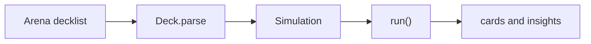

## Introduction

Thanks for contributing to `@lggarrison/landlord-ts`!

Open PRs against **`develop`** (the default integration branch). Releases are cut from **`main`** via PR `develop` → `main`. Fill in the sections that apply and delete the rest, including the Introduction section.

## Summary

_One or two sentences: what does this change do, and why?_

_For non-trivial flows or architecture, consider a Mermaid diagram (see **Diagrams** below)._

## Changes

_Bullet the notable changes. Call out anything that affects the published surface: `run()` Input/Output, package exports, shipped `data/all_cards.json.gz`, or `scripts/card-update.ts`._

## Diagrams (optional)

For flows, architecture, or branch history, add a [Mermaid](https://mermaid.js.org/) diagram in the PR body. GitHub renders fenced ` ```mermaid ` blocks inline — no image uploads needed.

Good fits: decklist → simulation → observations, mulligan/auto-tap behavior, card-update pipeline.



Delete this section if a diagram does not add clarity.

## How to verify

_Exact commands a reviewer can run. For example:_

```bash
npm test
npm run build
npm run wiki:lint
```

## Checklist

- [ ] `npm run lint` passes
- [ ] `npm run format:check` passes
- [ ] `npm test` passes
- [ ] `npm run build` succeeds
- [ ] If `wiki/` changed: `npm run wiki:build` produces no diff and `npm run wiki:lint` passes
- [ ] Docs updated (README / wiki) if behavior or the published surface changed
- [ ] No secrets or credentials committed

## Notes

_Optional: follow-ups, known limitations, or anything reviewers should be aware of._
