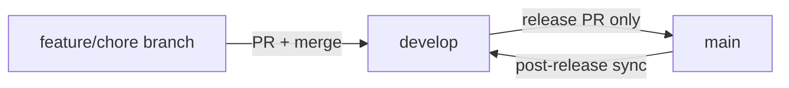

# GitHub repo hygiene

Day-to-day integration happens on **`develop`**. **`main`** is release-only.

## Branch model

| Branch                       | Role                                                              |
| ---------------------------- | ----------------------------------------------------------------- |
| `develop`                    | Default branch. All feature, fix, and chore PRs target here.      |
| `main`                       | Release branch. Merge from `develop` only when cutting a release. |
| `feat/*`, `fix/*`, `chore/*` | Short-lived branches off `develop`.                               |

## Everyday work

1. Branch off latest `develop` (e.g. `feat/board-aware-lands`).
2. Open a PR with **base = `develop`** (never `main`).
3. Merge when CI is green.
4. Delete the feature branch after merge.

Automated card refreshes (`.github/workflows/card-update.yml`) open PRs into `develop` on a `chore/card-update` branch.

## Releases

Follow `RELEASING.md`:

1. Prepare version/changelog on `develop`.
2. Open **`develop` → `main`** release PR; merge with a **merge commit** (not squash).
3. Tag `vX.Y.Z` on `main`; release workflow publishes and syncs `main` back into `develop`.

Do not land feature work directly on `main`.

## Protection (maintainers)

| Branch    | Rules                                                        |
| --------- | ------------------------------------------------------------ |
| `develop` | Block deletion and force-push; prefer PR + CI                |
| `main`    | Block deletion and force-push; **PR required**; CI must pass |

## See also

- [Src](../entities/src.md)

Human docs (repo root): `CONTRIBUTING.md`, `RELEASING.md`.
